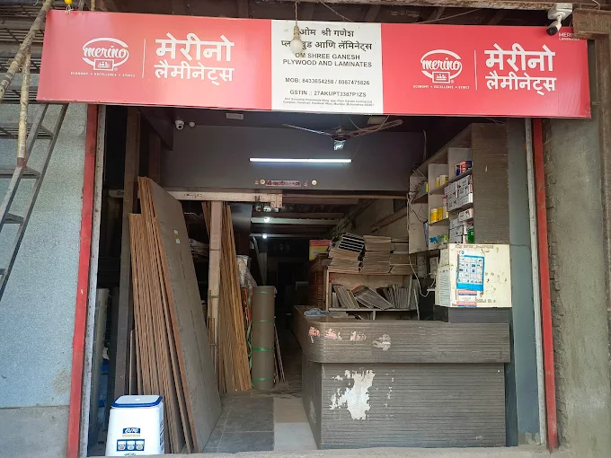

<p align="center">
  
</p>

<h1 align="center">🪵 Om Shree Ganesh Plywood & Laminate</h1>

<p align="center">
  <strong>A modern, responsive business website for Om Shree Ganesh Plywood and Laminates — your trusted partner for plywood, laminates, adhesives & more.</strong>
</p>

<p align="center">
  
  
  
  
</p>

---

## 📋 Table of Contents

- [About](#-about)
- [Page Sections](#-page-sections)
- [Tech Stack](#-tech-stack)
- [Getting Started](#-getting-started)
- [Project Structure](#-project-structure)
- [Features](#-features)
- [Contact](#-contact)

---

## 🏪 About

This is the official website for **Om Shree Ganesh Plywood and Laminates**, a plywood and interior materials shop located in **Kandivali West, Mumbai, Maharashtra**. The site showcases products, services, and provides an easy way for customers to get in touch.

---

## 📄 Page Sections

| # | Section | Description |
|---|---------|-------------|
| 1 | **Navbar** | Responsive navigation bar with links to all sections and a call-to-action button |
| 2 | **Hero** | Full-screen hero banner with shop image background, tagline, and CTA buttons (Call Now, Get a Quote, View Products) |
| 3 | **Product Showcase** | Grid display of 9 products including Premium Plywood, Decorative Laminates, PVC Laminates, Adhesives, Tikwood & Salwood, MDF Boards, Fevicool Marine, Abro Tape, and Super Grip Bond |
| 4 | **Why Choose Us** | 6 feature cards highlighting — Premium Materials, Wide Product Range, Competitive Pricing, Fast Delivery, Expert Advice, and Bulk Order Discounts |
| 5 | **About Us** | Company story, mission, and key stats (5+ Years Experience, 500+ Happy Customers, 30+ Products) |
| 6 | **Gallery** | 12-image photo gallery with lightbox viewer showcasing the shop, products, and installations |
| 7 | **Testimonials** | Customer reviews with star ratings, responsive slider on mobile and grid on desktop |
| 8 | **Contact** | Contact info (address, phone, email, hours), a working contact form powered by Web3Forms, and an embedded Google Maps location |
| 9 | **Footer** | Quick links, product categories, social media links, and full contact details |
| 10 | **Floating Action Button** | Sticky WhatsApp/Call button for quick customer access |

---

## 🛠 Tech Stack

| Technology | Purpose |
|-----------|---------|
| **React 18** | UI component library |
| **TypeScript** | Type-safe JavaScript |
| **Vite** | Fast build tool & dev server |
| **Tailwind CSS** | Utility-first CSS framework |
| **Lucide React** | Icon library |
| **React Icons** | Additional icon set |
| **Web3Forms** | Contact form backend (no server needed) |
| **Google Maps Embed** | Location map |

---

## 🚀 Getting Started

### Prerequisites

- Node.js (v18 or higher recommended)
- npm or yarn

### Installation

```bash
# Clone the repository
git clone https://github.com/your-username/Om-Shree-Ganesh-Plywood-and-Laminate.git

# Navigate to the project
cd Om-Shree-Ganesh-Plywood-and-Laminate

# Install dependencies
npm install

# Start the development server
npm run dev
```

### Build for Production

```bash
npm run build
```

### Preview Production Build

```bash
npm run preview
```

---

## 📁 Project Structure

```
Om-Shree-Ganesh-Plywood-and-Laminate/
├── public/
│   └── images/              # Static product & shop images
├── src/
│   ├── components/
│   │   ├── Navbar.tsx           # Navigation bar
│   │   ├── Hero.tsx             # Hero/banner section
│   │   ├── ProductShowcase.tsx  # Product grid display
│   │   ├── WhyChooseUs.tsx      # Features/benefits section
│   │   ├── AboutUs.tsx          # Company story & stats
│   │   ├── Gallery.tsx          # Photo gallery with lightbox
│   │   ├── Testimonials.tsx     # Customer reviews carousel
│   │   ├── Contact.tsx          # Contact form & info
│   │   ├── Footer.tsx           # Site footer
│   │   ├── FloatingActionButton.tsx  # Sticky CTA button
│   │   ├── DeveloperProfile.tsx # Developer credit
│   │   └── SpecialOffers.tsx    # Promotional offers
│   ├── App.tsx              # Main app component
│   ├── main.tsx             # Entry point
│   └── index.css            # Global styles & Tailwind imports
├── index.html               # HTML template
├── tailwind.config.js       # Tailwind configuration
├── vite.config.ts           # Vite configuration
├── tsconfig.json            # TypeScript configuration
└── package.json             # Dependencies & scripts
```

---

## ✨ Features

- ✅ **Fully Responsive** — Works seamlessly on mobile, tablet, and desktop
- ✅ **Fast Performance** — Built with Vite for lightning-fast load times
- ✅ **SEO Friendly** — Semantic HTML structure
- ✅ **Working Contact Form** — Powered by Web3Forms (no backend required)
- ✅ **Image Lightbox** — Click-to-zoom gallery experience
- ✅ **Smooth Animations** — Hover effects and transitions throughout
- ✅ **Google Maps Integration** — Embedded map showing shop location
- ✅ **One-Click Contact** — Direct call and WhatsApp buttons
- ✅ **Mobile Slider** — Touch-friendly testimonial carousel on mobile
- ✅ **Parallax Hero** — Fixed background scrolling effect

---

## 📞 Contact

**Om Shree Ganesh Plywood and Laminates**

- 📍 Shri Sevantilal Khandwala Marg, opp. Rajiv Gandhi Commercial Complex, Kandivali West, Mumbai, Maharashtra 400067
- 📱 +91 8087475826 | +91 8433654258
- 📧 omshreeganeshplywood@gmail.com
- 🕐 Mon–Sat: 9:00 AM – 8:00 PM | Sun: 10:00 AM – 4:00 PM

---

<p align="center">
  Made with ❤️ for Om Shree Ganesh Plywood & Laminate
</p>
